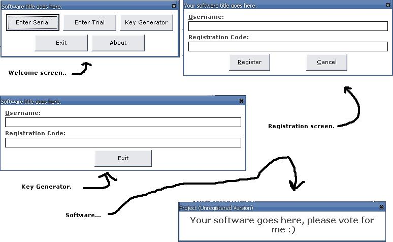



## Trial Registration System\.

### Description

..You can add this to your project to provide a secure registration system..
 
### More Info
 
Tested on Windows XP Pro and works perfectly.

             |
---                |---
**Submitted On**   |2004-01-11 20:34:52
**By**             |[Lee Cook](https://github.com/Planet-Source-Code/PSCIndex/blob/master/ByAuthor/lee-cook.md)
**Level**          |Intermediate
**User Rating**    |4.6 (37 globes from 8 users)
**Compatibility**  |VB 6\.0
**Category**       |[Coding Standards](https://github.com/Planet-Source-Code/PSCIndex/blob/master/ByCategory/coding-standards__1-43.md)
**World**          |[Visual Basic](https://github.com/Planet-Source-Code/PSCIndex/blob/master/ByWorld/visual-basic.md)
**Archive File**   |[Trial\_Regi1737834262004\.zip](https://github.com/Planet-Source-Code/lee-cook-trial-registration-system__1-53401/archive/master.zip)

